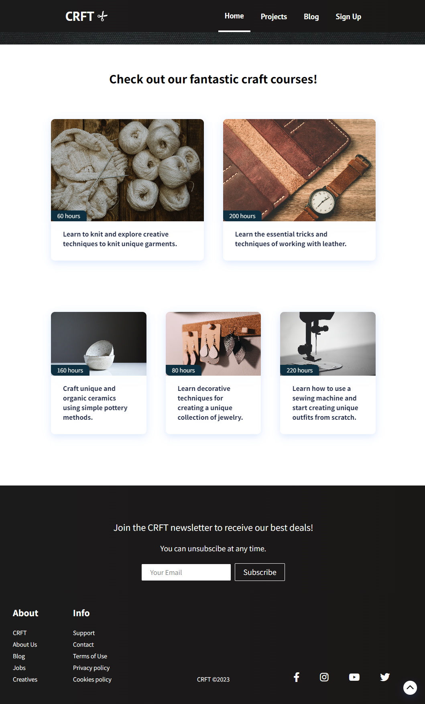

# Demo Craft Course Site

Find the running application via this link: [CRFT](https://anitaskumat.com/craft-app/). 

This pet-project was created to practice React.js & React Router.\
Opening the site you can find a hero section and under it a bunch of course cards. Each cards have their own page with their details. Navigation bar items are also working but only with a placeholder content.

## Usage

1. Clone the project

2. Install *dependencies* listed in package.json (in the main folder)
```
npm install
```

3. Run the app in the development mode
```
npm start
```
Open [http://localhost:3000](http://localhost:3000) to view it in your browser.

## Preview
